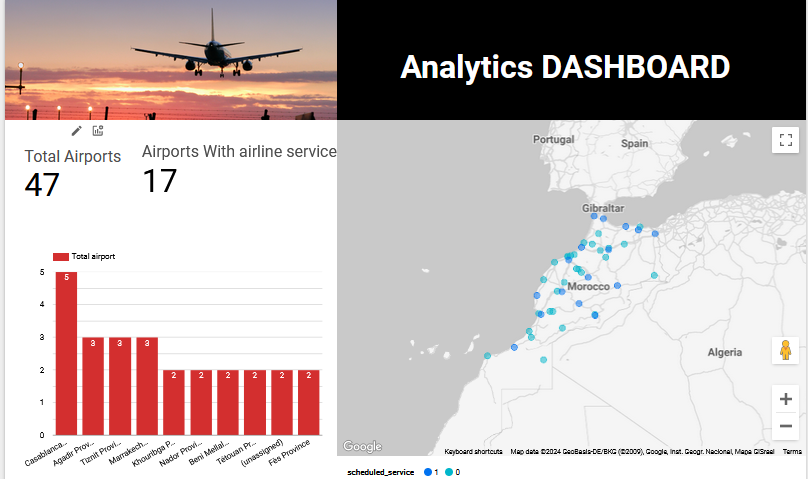

# Moroccan Airport Data Analytics | Modern Data Analytic GCP Project

## Introduction

The goal of this project is to perform data analytics on Moroccan dataset using various tools and technologies, including GCP Storage, Python, Compute Instance, Mage Data Pipeline Tool, BigQuery, and Looker Studio.

## Architecture 

## Technology Used
- Programming Language - Python

Google Cloud Platform
1. Google Storage
2. Compute Instance 
3. BigQuery
4. Looker Studio

Modern Data Pipeine Tool - https://www.mage.ai/

Contibute to this open source project - https://github.com/mage-ai/mage-ai

## Dataset Used

Airports in Morocco
List of airports in Morocco, with latitude and longitude. Unverified community data from http://ourairports.com/countries/MA/

## Result

